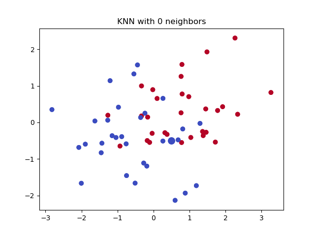
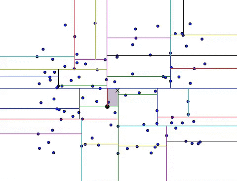

# Machine Learning
## k-nearest-neighbor

In pattern recognition, the k-nearest neighbors algorithm (k-NN) is a non-parametric method used for classification and regression

k-NN is a type of instance-based learning, or lazy learning, where the function is only approximated locally and all computation is deferred until classification. The k-NN algorithm is among the simplest of all machine learning algorithms.

Knn has different distance calculation approaches such as euclidean,manhattan,minkowski and hamming distance
Knn has different algorithms bruteforce,KDD tree and ball tree.

/t/t/t/t**HERE IS AN EXAMPLE HOW KNN WORKS**

<p align="center">
  
</p>

## Getting Started 

This is a Basic Machine learning Algorithm K-nearest-neighbour The lazy learner has different algorithms and distance calculation approaches in this we have used brute force with ecludian distance. Soon KDtree and BallTree will be updated.

<p align="center">
  
</p>

## Prerequisites

PYTHON
SKLEARN
PANDAS
NUMPY
matplotlib
```
pip install scikit-learn
PIP INSTALL PANDAS
PIP INSTALL NUMPY
```

## Deployment

**Clone the Repo and then Just install the Prerequisites and you are good to go**
