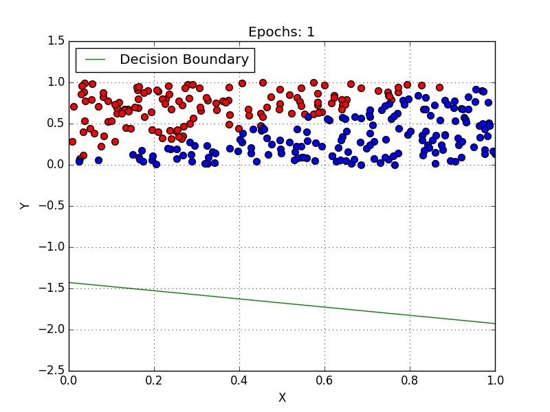

# Machine Learning
## Logistic Regression

In statistics, the logistic model (or logit model) is a widely used statistical model that, in its basic form, uses a logistic function to model a binary dependent variable; many more complex extensions exist. In regression analysis, logistic regression (or logit regression) is estimating the parameters of a logistic model; it is a form of binomial regression. Mathematically, a binary logistic model has a dependent variable with two possible values, such as pass/fail, win/lose, alive/dead or healthy/sick; these are represented by an indicator variable, where the two values are labeled "0" and "1".

**HERE IS AN EXAMPLE How Logistic Regression WORKS**

<p align="center">
  
</p>

## Getting Started 

Logistic regression is a classification algorithm used to assign observations to a discrete set of classes. Unlike linear regression which outputs continuous number values, logistic regression transforms its output using the logistic sigmoid function to return a probability value which can then be mapped to two or more discrete classes.

<p align="center">
  
</p>


## Prerequisites

PYTHON
SKLEARN
PANDAS
NUMPY

```
pip install scikit-learn
PIP INSTALL PANDAS
PIP INSTALL NUMPY
```

## Deployment

**Clone the Repo and then Just install the Prerequisites and you are good to go**
