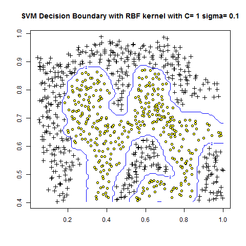

# Machine Learning
## SVM

In machine learning, support-vector machines are supervised learning models with associated learning algorithms that analyze data used for classification and regression analysis.

In addition to performing linear classification, SVMs can efficiently perform a non-linear classification using what is called the kernel trick, implicitly mapping their inputs into high-dimensional feature spaces.

<div align="center">
<h2>HERE IS AN EXAMPLE HOW SVM WORKS</h2>
</div>

<p align="center">
  
</p>

## Getting Started 

Here we have both linear and non Linear SVM you can check out how svm actully works.
More formally, a support-vector machine constructs a hyperplane or set of hyperplanes in a high- or infinite-dimensional space, which can be used for classification, regression, or other tasks like outliers detection. Intuitively, a good separation is achieved by the hyperplane that has the largest distance to the nearest training-data point of any class (so-called functional margin), since in general the larger the margin, the lower the generalization error of the classifier.


<p align="center">
  
</p>

<div align="center">
<h2>SVM WITH RBF Example</h2>
</div>

<p align="center">
  
</p>

## Prerequisites

PYTHON
SKLEARN
PANDAS
NUMPY
matplotlib
```
pip install scikit-learn
PIP INSTALL PANDAS
PIP INSTALL NUMPY
```

## Deployment

**Clone the Repo and then Just install the Prerequisites and you are good to go**
